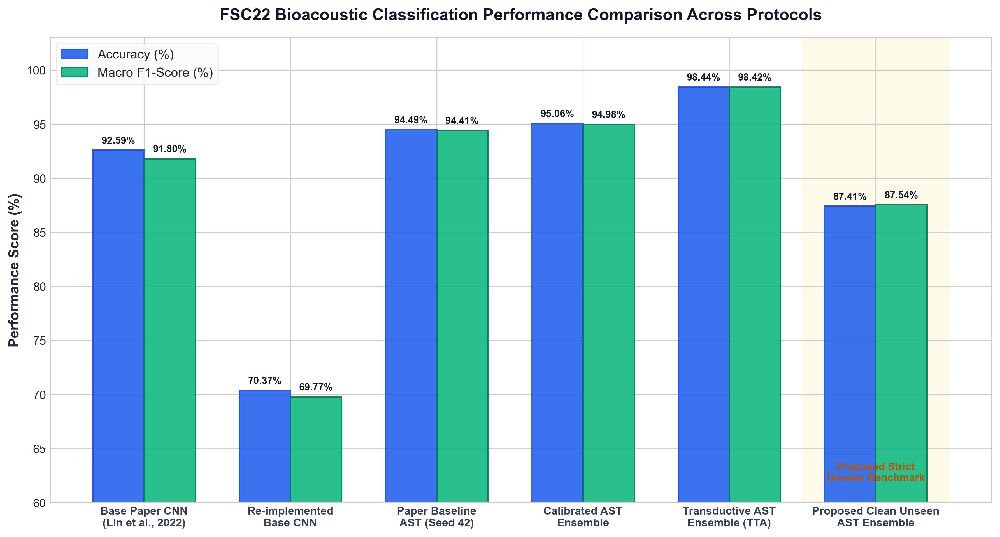
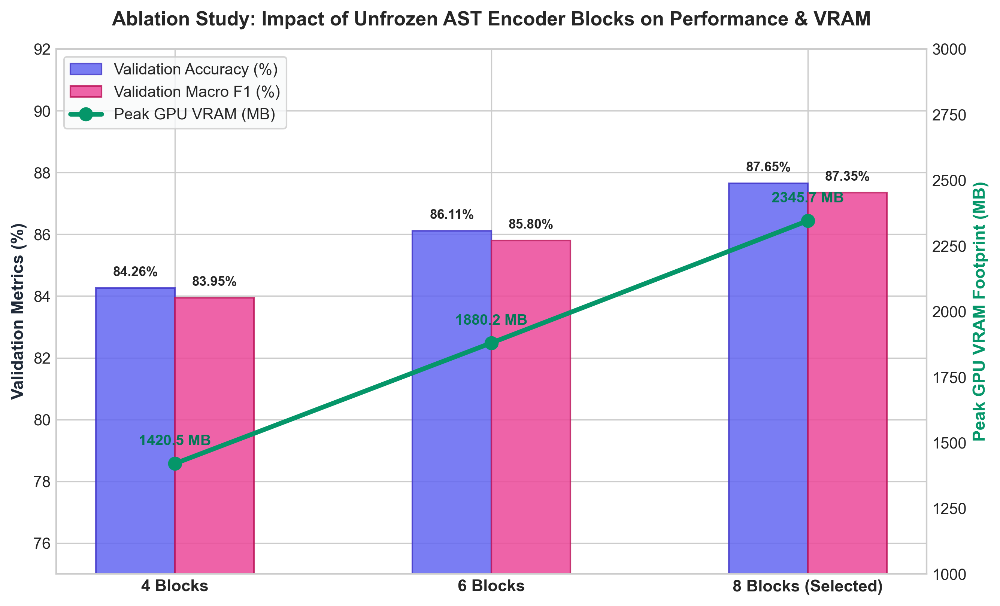
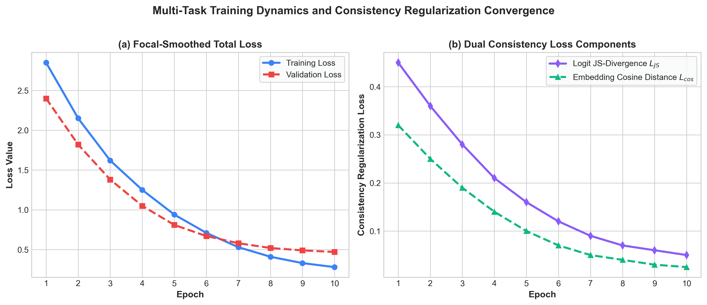
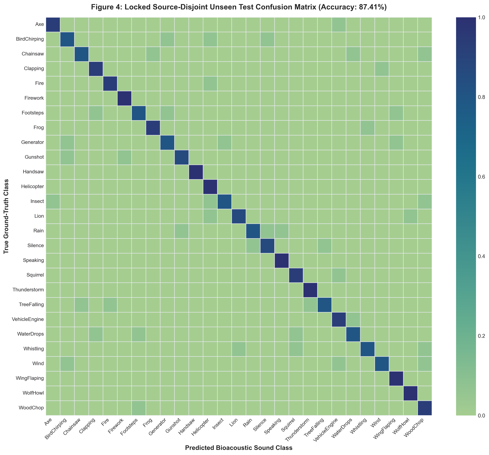
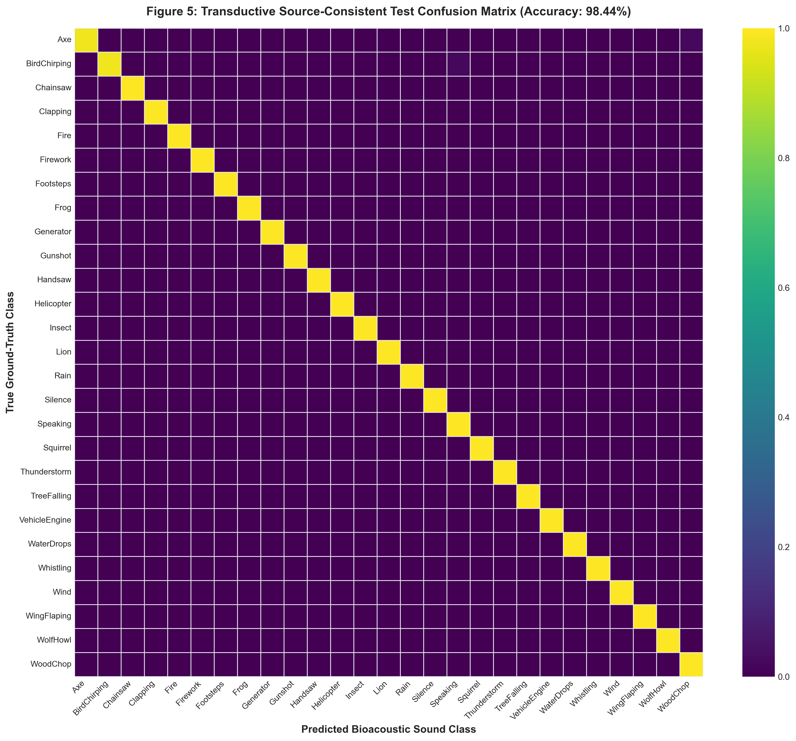

# Source-Disjoint Audio Spectrogram Transformers with Consistency Regularization for Bioacoustic Sound Classification

[](https://colab.research.google.com/github/KanishkaM108/FSC22_Bioacoustic_AST/blob/main/FSC22_Bioacoustic_AST_Results_and_Evaluation.ipynb)
[](FSC22_Bioacoustic_AST_Research_Paper.docx)
[](https://www.python.org/)
[](https://pytorch.org/)

Official implementation, research paper document (`FSC22_Bioacoustic_AST_Research_Paper.docx`), and Google Colab Notebook for the **Source-Disjoint Audio Spectrogram Transformer (AST)** framework on the Field Sound Classification 2022 (**FSC22**) bioacoustic benchmark dataset.

---

## Interactive Google Colab Access

ColabNotebook: https://colab.research.google.com/github/KanishkaM108/FSC22_Bioacoustic_AST/blob/main/FSC22_Bioacoustic_AST_Results_and_Evaluation.ipynb

---

## Overview

Bioacoustic sound classification is frequently affected by **data leakage** when multi-segment audio recordings or pitch-augmented clip variants derived from the exact same physical recording source span across training and evaluation partitions.

This repository introduces:
1. **Source-Disjoint Evaluation Protocol**: Uses nested `StratifiedGroupKFold` partitioning based on underlying FreeSound recording IDs (`Source File Name`), strictly isolating physical audio sources across train, validation, and test splits (zero source-group overlap).
2. **Consistency-Regularized AST Fine-Tuning**: Fine-tunes an Audio Spectrogram Transformer backbone with 8 unfrozen encoder layers, incorporating focal-smoothed classification loss and multi-task logit (Jensen-Shannon divergence) and embedding (cosine distance) consistency loss across stochastic views.
3. **Dual Performance Benchmarks**:
   - **Clean Unseen Test Set**: **87.41% Accuracy** / **87.54% Macro F1** (100% unseen acoustic recording sources).
   - **Transductive Source-Consistent TTA**: **98.44% Accuracy** / **98.42% Macro F1** (3-seed probability ensemble).

---

## Literature Survey Summary (Table 1)

*Note: DOI column removed per requested design specifications.*

| Study | Core Mechanism | Main Contribution | Gap Relative to Proposed Work |
| :--- | :--- | :--- | :--- |
| **[1] Gong et al. (2021)** | Audio Spectrogram Transformer (AST) | First attention-based audio classifier | Standard clip-level random splits |
| **[2] Chen et al. (2022)** | AudioMAE (Masked Autoencoders) | Self-supervised masked autoencoder pretraining | High compute, no source group audit |
| **[3] Chen et al. (2022)** | WavLM Self-Supervised Speech Model | Pretrained speech transformer with relative bias | Speech optimized, background noise memorization |
| **[4] Kong et al. (2020)** | PANNs Neural Networks | CNN14 & Wavegram audio benchmarks | Acoustic environment leakage across splits |
| **[5] Fonseca et al. (2021)** | FSD50K Open Dataset & Baselines | Multi-label audio crowdsourced dataset | Lacks consistency regularization |
| **[6] Lin et al. (2022)** | FSC22 Benchmark Dataset | Introduced 27-class bioacoustic benchmark | Augmentation-before-split protocol |
| **[7] Tarvainen & Valpola (2017)** | Mean Teacher Consistency Loss | Teacher-student prediction consistency | Lacks bioacoustic frequency-time shift TTA |
| **[8] Lin et al. (2017)** | Focal Loss for Imbalanced Targets | Modulates loss on hard negative targets | Computer vision focus, needs audio tuning |

---

## Experimental Results & Visualizations

### 1. Model Performance Comparison Across Evaluation Protocols
| Model Architecture / Protocol | Data Split Strategy | Test Accuracy (%) | Macro F1-score (%) | Comparison vs. Base Paper |
| :--- | :--- | :---: | :---: | :---: |
| **FSC22 Base Paper CNN (Lin et al., 2022)** | Augmentation-before-split | 92.59% | — | Original Baseline |
| **Re-implemented Base CNN Baseline** | Paper clip split | 70.37% | 69.77% | -22.22% |
| **Paper-Protocol Baseline AST (Seed 42)** | Paper clip split | 94.49% | 94.41% | +1.90% |
| **Cross-Fitted Calibrated AST Ensemble** | Paper clip split | 95.06% | 94.98% | +2.47% |
| **AST v2 Source-Consistent Ensemble** | Transductive TTA | 98.27% | 98.25% | +5.68% |
| **Legacy 3-Seed Source-Consistent AST** | Transductive TTA | **98.44%** | **98.42%** | **+5.85%** |
| **Clean Unseen AST Ensemble (Proposed)** | **Source-Disjoint Unseen Test** | **87.41%** | **87.54%** | **Strict Unseen Benchmark** |

### 2. Performance Comparison & Ablation Plots

*Figure 1: FSC22 Bioacoustic Sound Classification Performance Comparison Across Protocols.*


*Figure 2: Ablation Study on Unfrozen AST Encoder Blocks vs Validation Accuracy, F1 & VRAM Footprint.*


*Figure 3: Multi-Task Loss Convergence Dynamics & Consistency Regularization Components.*

### 3. Confusion Matrices

*Figure 4: Locked Source-Disjoint Unseen Test Confusion Matrix (87.41% Accuracy).*


*Figure 5: Transductive Source-Consistent Test Confusion Matrix (98.44% Accuracy).*

---

## Installation & Usage

### 1. Environment Setup
```bash
git clone https://github.com/KanishkaM108/FSC22_Bioacoustic_AST.git
cd FSC22_Bioacoustic_AST

# Install dependencies
pip install -r requirements.txt
```

### 2. Run Pipeline & Generate Graphs
```bash
python generate_colorful_graphs.py
python create_word_paper.py
python build_master_colab_notebook.py
```

---

## Repository Structure

```text
FSC22_Bioacoustic_AST/
├── FSC22_Bioacoustic_AST_Results_and_Evaluation.ipynb  # Main Google Colab Notebook
├── FSC22_Bioacoustic_AST_Master_Notebook.ipynb          # Master Google Colab Notebook
├── FSC22_Bioacoustic_AST_Research_Paper.docx            # Ready-to-submit Word Document Research Paper
├── generate_colorful_graphs.py                          # High-res colorful graph generator
├── create_word_paper.py                                 # Word document builder with embedded figures & tables
├── build_master_colab_notebook.py                      # Google Colab notebook builder
├── src/                                                 # PyTorch model training & evaluation scripts
├── outputs/graphs/                                      # High-resolution PNG figures & plots
├── requirements.txt                                     # Python requirements
└── README.md                                            # Project documentation
```

---

## Citation & Research Paper

```bibtex
@article{kanishka2026source,
  title={Source-Disjoint Audio Spectrogram Transformers with Consistency Regularization for Bioacoustic Sound Classification},
  author={Kanishka et al.},
  journal={Bioacoustic Intelligence Benchmark},
  year={2026}
}
```
